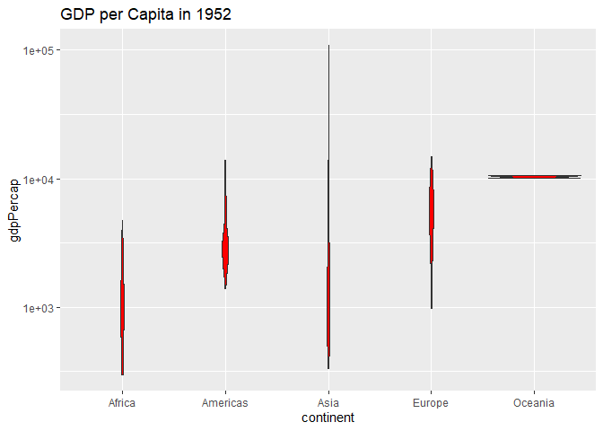
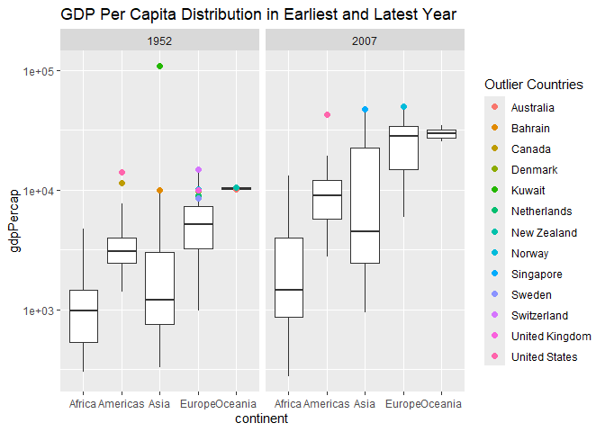
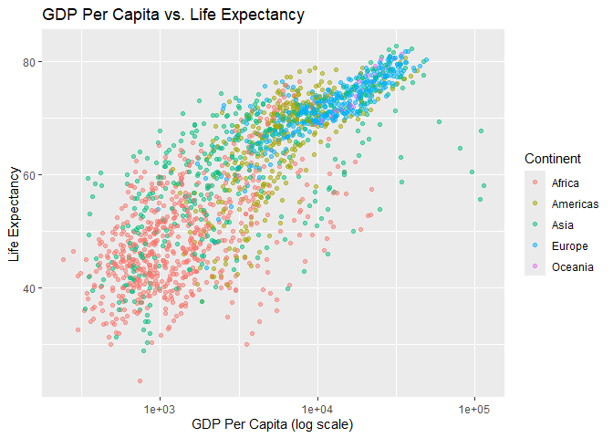
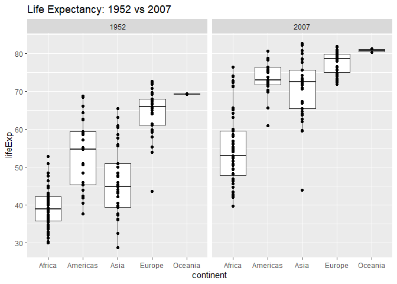
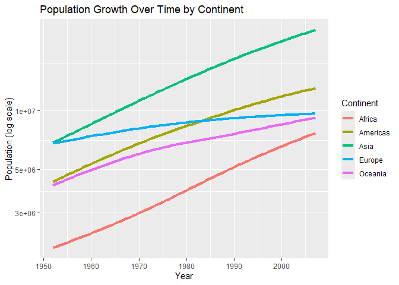

Gapminder
================
Danny Kennen
3/2/2025

- [Grading Rubric](#grading-rubric)
  - [Individual](#individual)
  - [Submission](#submission)
- [Guided EDA](#guided-eda)
  - [**q0** Perform your “first checks” on the dataset. What variables
    are in
    this](#q0-perform-your-first-checks-on-the-dataset-what-variables-are-in-this)
  - [**q1** Determine the most and least recent years in the `gapminder`
    dataset.](#q1-determine-the-most-and-least-recent-years-in-the-gapminder-dataset)
  - [**q2** Filter on years matching `year_min`, and make a plot of the
    GDP per capita against continent. Choose an appropriate `geom_` to
    visualize the data. What observations can you
    make?](#q2-filter-on-years-matching-year_min-and-make-a-plot-of-the-gdp-per-capita-against-continent-choose-an-appropriate-geom_-to-visualize-the-data-what-observations-can-you-make)
  - [**q3** You should have found *at least* three outliers in q2 (but
    possibly many more!). Identify those outliers (figure out which
    countries they
    are).](#q3-you-should-have-found-at-least-three-outliers-in-q2-but-possibly-many-more-identify-those-outliers-figure-out-which-countries-they-are)
  - [**q4** Create a plot similar to yours from q2 studying both
    `year_min` and `year_max`. Find a way to highlight the outliers from
    q3 on your plot *in a way that lets you identify which country is
    which*. Compare the patterns between `year_min` and
    `year_max`.](#q4-create-a-plot-similar-to-yours-from-q2-studying-both-year_min-and-year_max-find-a-way-to-highlight-the-outliers-from-q3-on-your-plot-in-a-way-that-lets-you-identify-which-country-is-which-compare-the-patterns-between-year_min-and-year_max)
- [Your Own EDA](#your-own-eda)
  - [**q5** Create *at least* three new figures below. With each figure,
    try to pose new questions about the
    data.](#q5-create-at-least-three-new-figures-below-with-each-figure-try-to-pose-new-questions-about-the-data)

*Purpose*: Learning to do EDA well takes practice! In this challenge
you’ll further practice EDA by first completing a guided exploration,
then by conducting your own investigation. This challenge will also give
you a chance to use the wide variety of visual tools we’ve been
learning.

<!-- include-rubric -->

# Grading Rubric

<!-- -------------------------------------------------- -->

Unlike exercises, **challenges will be graded**. The following rubrics
define how you will be graded, both on an individual and team basis.

## Individual

<!-- ------------------------- -->

| Category | Needs Improvement | Satisfactory |
|----|----|----|
| Effort | Some task **q**’s left unattempted | All task **q**’s attempted |
| Observed | Did not document observations, or observations incorrect | Documented correct observations based on analysis |
| Supported | Some observations not clearly supported by analysis | All observations clearly supported by analysis (table, graph, etc.) |
| Assessed | Observations include claims not supported by the data, or reflect a level of certainty not warranted by the data | Observations are appropriately qualified by the quality & relevance of the data and (in)conclusiveness of the support |
| Specified | Uses the phrase “more data are necessary” without clarification | Any statement that “more data are necessary” specifies which *specific* data are needed to answer what *specific* question |
| Code Styled | Violations of the [style guide](https://style.tidyverse.org/) hinder readability | Code sufficiently close to the [style guide](https://style.tidyverse.org/) |

## Submission

<!-- ------------------------- -->

Make sure to commit both the challenge report (`report.md` file) and
supporting files (`report_files/` folder) when you are done! Then submit
a link to Canvas. **Your Challenge submission is not complete without
all files uploaded to GitHub.**

``` r
library(tidyverse)
```

    ## ── Attaching core tidyverse packages ──────────────────────── tidyverse 2.0.0 ──
    ## ✔ dplyr     1.1.4     ✔ readr     2.1.5
    ## ✔ forcats   1.0.0     ✔ stringr   1.5.1
    ## ✔ ggplot2   3.5.1     ✔ tibble    3.2.1
    ## ✔ lubridate 1.9.4     ✔ tidyr     1.3.1
    ## ✔ purrr     1.0.2     
    ## ── Conflicts ────────────────────────────────────────── tidyverse_conflicts() ──
    ## ✖ dplyr::filter() masks stats::filter()
    ## ✖ dplyr::lag()    masks stats::lag()
    ## ℹ Use the conflicted package (<http://conflicted.r-lib.org/>) to force all conflicts to become errors

``` r
library(gapminder)
```

*Background*: [Gapminder](https://www.gapminder.org/about-gapminder/) is
an independent organization that seeks to educate people about the state
of the world. They seek to counteract the worldview constructed by a
hype-driven media cycle, and promote a “fact-based worldview” by
focusing on data. The dataset we’ll study in this challenge is from
Gapminder.

# Guided EDA

<!-- -------------------------------------------------- -->

First, we’ll go through a round of *guided EDA*. Try to pay attention to
the high-level process we’re going through—after this guided round
you’ll be responsible for doing another cycle of EDA on your own!

### **q0** Perform your “first checks” on the dataset. What variables are in this

dataset?

``` r
## TASK: Do your "first checks" here!
summary(gapminder)
```

    ##         country        continent        year         lifeExp     
    ##  Afghanistan:  12   Africa  :624   Min.   :1952   Min.   :23.60  
    ##  Albania    :  12   Americas:300   1st Qu.:1966   1st Qu.:48.20  
    ##  Algeria    :  12   Asia    :396   Median :1980   Median :60.71  
    ##  Angola     :  12   Europe  :360   Mean   :1980   Mean   :59.47  
    ##  Argentina  :  12   Oceania : 24   3rd Qu.:1993   3rd Qu.:70.85  
    ##  Australia  :  12                  Max.   :2007   Max.   :82.60  
    ##  (Other)    :1632                                                
    ##       pop              gdpPercap       
    ##  Min.   :6.001e+04   Min.   :   241.2  
    ##  1st Qu.:2.794e+06   1st Qu.:  1202.1  
    ##  Median :7.024e+06   Median :  3531.8  
    ##  Mean   :2.960e+07   Mean   :  7215.3  
    ##  3rd Qu.:1.959e+07   3rd Qu.:  9325.5  
    ##  Max.   :1.319e+09   Max.   :113523.1  
    ## 

``` r
glimpse(gapminder)
```

    ## Rows: 1,704
    ## Columns: 6
    ## $ country   <fct> "Afghanistan", "Afghanistan", "Afghanistan", "Afghanistan", …
    ## $ continent <fct> Asia, Asia, Asia, Asia, Asia, Asia, Asia, Asia, Asia, Asia, …
    ## $ year      <int> 1952, 1957, 1962, 1967, 1972, 1977, 1982, 1987, 1992, 1997, …
    ## $ lifeExp   <dbl> 28.801, 30.332, 31.997, 34.020, 36.088, 38.438, 39.854, 40.8…
    ## $ pop       <int> 8425333, 9240934, 10267083, 11537966, 13079460, 14880372, 12…
    ## $ gdpPercap <dbl> 779.4453, 820.8530, 853.1007, 836.1971, 739.9811, 786.1134, …

**Observations**:

- country - The countries in the data set
- continent - How many countries are on a given continent
- year - The year the data was collected
- lifeExp - The life expectancy of each country
- pop - The population of each country
- gdpPercap - The GDP per capital of each country

### **q1** Determine the most and least recent years in the `gapminder` dataset.

*Hint*: Use the `pull()` function to get a vector out of a tibble.
(Rather than the `$` notation of base R.)

``` r
## TASK: Find the largest and smallest values of `year` in `gapminder`

year_max <-
  gapminder %>%
  pull(year) %>%
  max()

year_min <-
  gapminder %>%
  pull(year) %>%
  min()
```

Use the following test to check your work.

``` r
## NOTE: No need to change this
assertthat::assert_that(year_max %% 7 == 5)
```

    ## [1] TRUE

``` r
assertthat::assert_that(year_max %% 3 == 0)
```

    ## [1] TRUE

``` r
assertthat::assert_that(year_min %% 7 == 6)
```

    ## [1] TRUE

``` r
assertthat::assert_that(year_min %% 3 == 2)
```

    ## [1] TRUE

``` r
if (is_tibble(year_max)) {
  print("year_max is a tibble; try using `pull()` to get a vector")
  assertthat::assert_that(False)
}

print("Nice!")
```

    ## [1] "Nice!"

### **q2** Filter on years matching `year_min`, and make a plot of the GDP per capita against continent. Choose an appropriate `geom_` to visualize the data. What observations can you make?

You may encounter difficulties in visualizing these data; if so document
your challenges and attempt to produce the most informative visual you
can.

``` r
## TASK: Create a visual of gdpPercap vs continent

gapminder_min_year <- gapminder %>% 
  filter(year == year_min)

#plot
ggplot(gapminder_min_year, aes(x = continent, y = gdpPercap)) +
  scale_y_log10()+
  geom_violin(fill = "red") + 
  labs(title = "GDP per Capita in 1952") 
```

<!-- -->

**Observations**:

- Asia has a pretty extreme outlier that has a much higher GDP compared
  to the other countries in Asia
- Oceana has very litter variability among it’s countries, they all seem
  to have the same GPD
- The Americas has a few outliers but most countries stay within a
  certain range.
- Africa has more variability the other continents with pockets in
  different gdp ranges.
- Europe mostly is within a particular GDP range but it has a slight
  outlier in above most of the other European countries, and a pretty
  big outlier lower then the rest of the European countries.

**Difficulties & Approaches**:

- I was unsure what plot would be the best for demonstrating the
  information. I looked on Google and found the violin plot. It’s a plot
  I haven’t seen much of and on top of being interesting I thought it
  was a good chart for seeing general trends at a quick glance. If I
  hadn’t found the violin plots I would have likely chosen a box plot,
  because box plots convey similar information. It would easily show
  where out-liers where as well as where the mean of GPD’s were.

### **q3** You should have found *at least* three outliers in q2 (but possibly many more!). Identify those outliers (figure out which countries they are).

``` r
## TASK: Identify the outliers from q2

q1 <- quantile(gapminder_min_year %>% pull(gdpPercap), 0.25)
q3 <- quantile(gapminder_min_year %>% pull(gdpPercap), 0.75)
iqr <- q3 - q1


lower_bound <- q1 - 1.5 * iqr
upper_bound <- q3 + 1.5 * iqr

outliers <- gapminder_min_year %>%
  filter(gdpPercap < lower_bound | gdpPercap > upper_bound) %>%
  select(country, gdpPercap) %>%
  arrange(desc(gdpPercap))

print(outliers)
```

    ## # A tibble: 12 × 2
    ##    country        gdpPercap
    ##    <fct>              <dbl>
    ##  1 Kuwait           108382.
    ##  2 Switzerland       14734.
    ##  3 United States     13990.
    ##  4 Canada            11367.
    ##  5 New Zealand       10557.
    ##  6 Norway            10095.
    ##  7 Australia         10040.
    ##  8 United Kingdom     9980.
    ##  9 Bahrain            9867.
    ## 10 Denmark            9692.
    ## 11 Netherlands        8942.
    ## 12 Sweden             8528.

**Observations**:

- Identify the outlier countries from q2
  - The top three GPD’s are Kuwait in Asia, Switzerland in Europe, and
    the United States in the Americas. This makes sense, Kuwait has a
    much higher GDP then anyone else which reflects what the plot says.
    Switzerland had the highest GDP of Europe and all the other
    countries are close to each other in GDP’s an a smooth decreasing
    order. The USA has the highest GDP of the Americas, but Canada is
    relatively close behind. This is an example of the the clumps of
    outliers that we see in the plot above for the Americas

*Hint*: For the next task, it’s helpful to know a ggplot trick we’ll
learn in an upcoming exercise: You can use the `data` argument inside
any `geom_*` to modify the data that will be plotted *by that geom
only*. For instance, you can use this trick to filter a set of points to
label:

``` r
## NOTE: No need to edit, use ideas from this in q4 below
gapminder %>%
  filter(year == max(year)) %>%

  ggplot(aes(continent, lifeExp)) +
  geom_boxplot() +
  geom_point(
    data = . %>% filter(country %in% c("United Kingdom", "Japan", "Zambia")),
    mapping = aes(color = country),
    size = 2
  )
```

<!-- -->

### **q4** Create a plot similar to yours from q2 studying both `year_min` and `year_max`. Find a way to highlight the outliers from q3 on your plot *in a way that lets you identify which country is which*. Compare the patterns between `year_min` and `year_max`.

*Hint*: We’ve learned a lot of different ways to show multiple
variables; think about using different aesthetics or facets.

``` r
## TASK: Create a visual of gdpPercap vs continent

# Filter dataset for both years
gapminder_filtered <- gapminder %>%
  filter(year %in% c(year_min, year_max))


outliers_min <- gapminder_min_year %>%
  filter(gdpPercap < lower_bound | gdpPercap > upper_bound) %>%
  select(country, continent, gdpPercap, year)

# Compute IQR and identify outliers for year_max
gapminder_max_year <- gapminder_filtered %>% filter(year == year_max)
q1_max <- quantile(gapminder_max_year$gdpPercap, 0.25)
q3_max <- quantile(gapminder_max_year$gdpPercap, 0.75)
iqr_max <- q3_max - q1_max

lower_bound_max <- q1_max - 1.5 * iqr_max
upper_bound_max <- q3_max + 1.5 * iqr_max

outliers_max <- gapminder_max_year %>%
  filter(gdpPercap < lower_bound_max | gdpPercap > upper_bound_max) %>%
  select(country, continent, gdpPercap, year)

# Combine outliers from both years
outliers <- bind_rows(outliers_min, outliers_max)

# Plot
gapminder_filtered %>%
  ggplot(aes(x = continent, y = gdpPercap)) +
 geom_boxplot(outlier.shape = NA) +  # Remove default outliers
  geom_point(
    data = outliers,
    mapping = aes(color = country),
    size = 2
  ) +  # Highlight outliers
  facet_wrap(~ year) +
  scale_y_log10() +
  labs(
    title = "GDP Per Capita Distribution in Earliest and Latest Year",
    color = "Outlier Countries"
  )
```

<!-- -->

**Observations**:

- The GDP’s of countries in every continent have higher maxes and higher
  minimums on 2007 than in 1952.
- The range of GDP’s also increased for each continent in 2007 than in
  1952
- In 2007 there are fewer outliers then in 1952

# Your Own EDA

<!-- -------------------------------------------------- -->

Now it’s your turn! We just went through guided EDA considering the GDP
per capita at two time points. You can continue looking at outliers,
consider different years, repeat the exercise with `lifeExp`, consider
the relationship between variables, or something else entirely.

### **q5** Create *at least* three new figures below. With each figure, try to pose new questions about the data.

``` r
## TASK: Your first graph
ggplot(gapminder, aes(x = gdpPercap, y = lifeExp, color = continent)) +
  geom_point(alpha = 0.5) +
  scale_x_log10() +
  labs(
    title = "GDP Per Capita vs. Life Expectancy",
    x = "GDP Per Capita (log scale)",
    y = "Life Expectancy",
    color = "Continent"
  )
```

<!-- -->

- Asia has the most range of GDP’s
- While there is a wide range of life expectancy through GDPs,
  especially within the African and Asian continents, there is a general
  theme of continents that on average have a higher GDP, they will have
  a higher life expectancy. This is particularly apparent with Europe.

``` r
## TASK: Your second graph

gapminder_filtered %>%
  ggplot(aes(x = continent, y = lifeExp)) +
  geom_boxplot() +
  geom_point() +
  facet_wrap(~ year) +
  labs(
    title = "Life Expectancy: 1952 vs 2007",
  )
```

<!-- -->

- The average life expectancy increased for every continent from 1952 to
  2007
- In The range of life expectancy also appears to shrink, countries from
  the same continent are closer to each other in life expectancy in 2007
  then they were in 1952

``` r
## TASK: Your third graph

ggplot(gapminder, aes(x = year, y = pop, color = continent)) +
  geom_smooth(se = FALSE, size = 1.5) +
  scale_y_log10() +
  labs(
    title = "Population Growth Over Time by Continent",
    x = "Year",
    y = "Population (log scale)",
    color = "Continent"
  )
```

    ## Warning: Using `size` aesthetic for lines was deprecated in ggplot2 3.4.0.
    ## ℹ Please use `linewidth` instead.
    ## This warning is displayed once every 8 hours.
    ## Call `lifecycle::last_lifecycle_warnings()` to see where this warning was
    ## generated.

    ## `geom_smooth()` using method = 'loess' and formula = 'y ~ x'

<!-- -->

- Populations have increase throughout time in every continent, although
  Europe hasn’t changed as much as the other continents, at least
  according to the smoothed line plot
