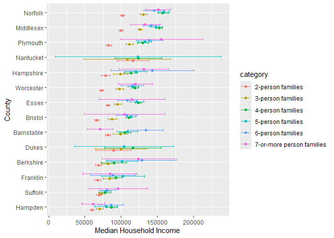
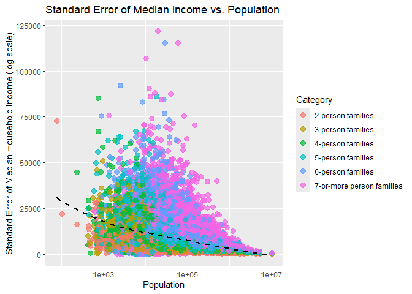
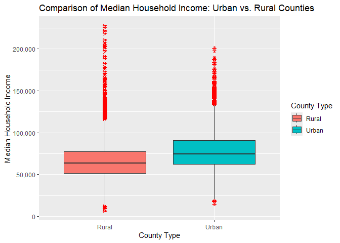

US Income
================
Danny Kennen
2025-04-06

------------------------------------------------------------------------

*Purpose*: We’ve been learning how to quantify uncertainty in estimates
through the exercises; now its time to put those skills to use studying
real data. In this challenge we’ll use concepts like confidence
intervals to help us make sense of census data.

*Reading*: - [Using ACS Estimates and Margin of
Error](https://www.census.gov/data/academy/webinars/2020/calculating-margins-of-error-acs.html)
(Optional, see the PDF on the page) - [Patterns and Causes of
Uncertainty in the American Community
Survey](https://www.sciencedirect.com/science/article/pii/S0143622813002518?casa_token=VddzQ1-spHMAAAAA:FTq92LXgiPVloJUVjnHs8Ma1HwvPigisAYtzfqaGbbRRwoknNq56Y2IzszmGgIGH4JAPzQN0)
(Optional, particularly the *Uncertainty in surveys* section under the
Introduction.)

<!-- include-rubric -->

# Grading Rubric

<!-- -------------------------------------------------- -->

Unlike exercises, **challenges will be graded**. The following rubrics
define how you will be graded, both on an individual and team basis.

## Individual

<!-- ------------------------- -->

| Category | Needs Improvement | Satisfactory |
|----|----|----|
| Effort | Some task **q**’s left unattempted | All task **q**’s attempted |
| Observed | Did not document observations, or observations incorrect | Documented correct observations based on analysis |
| Supported | Some observations not clearly supported by analysis | All observations clearly supported by analysis (table, graph, etc.) |
| Assessed | Observations include claims not supported by the data, or reflect a level of certainty not warranted by the data | Observations are appropriately qualified by the quality & relevance of the data and (in)conclusiveness of the support |
| Specified | Uses the phrase “more data are necessary” without clarification | Any statement that “more data are necessary” specifies which *specific* data are needed to answer what *specific* question |
| Code Styled | Violations of the [style guide](https://style.tidyverse.org/) hinder readability | Code sufficiently close to the [style guide](https://style.tidyverse.org/) |

## Submission

<!-- ------------------------- -->

Make sure to commit both the challenge report (`report.md` file) and
supporting files (`report_files/` folder) when you are done! Then submit
a link to Canvas. **Your Challenge submission is not complete without
all files uploaded to GitHub.**

# Setup

<!-- ----------------------------------------------------------------------- -->

``` r
library(tidyverse)
```

### **q1** Load the population data from c06; simply replace `filename_pop` below.

``` r
## TODO: Give the filename for your copy of Table B01003
filename_pop <- "./data/ACSDT5Y2018.B01003-Data.csv"

## NOTE: No need to edit
df_pop <-
  read_csv(
    filename_pop,
    skip = 1,
  ) %>% 
  rename(
    population_estimate = `Estimate!!Total`
  )
```

    ## New names:
    ## Rows: 3220 Columns: 5
    ## ── Column specification
    ## ──────────────────────────────────────────────────────────────────────────────────────────────── Delimiter: "," chr
    ## (3): Geography, Geographic Area Name, Margin of Error!!Total dbl (1): Estimate!!Total lgl (1): ...5
    ## ℹ Use `spec()` to retrieve the full column specification for this data. ℹ Specify the column types or set
    ## `show_col_types = FALSE` to quiet this message.
    ## • `` -> `...5`

``` r
df_pop
```

    ## # A tibble: 3,220 × 5
    ##    Geography      `Geographic Area Name`   population_estimate `Margin of Error!!Total` ...5 
    ##    <chr>          <chr>                                  <dbl> <chr>                    <lgl>
    ##  1 0500000US01001 Autauga County, Alabama                55200 *****                    NA   
    ##  2 0500000US01003 Baldwin County, Alabama               208107 *****                    NA   
    ##  3 0500000US01005 Barbour County, Alabama                25782 *****                    NA   
    ##  4 0500000US01007 Bibb County, Alabama                   22527 *****                    NA   
    ##  5 0500000US01009 Blount County, Alabama                 57645 *****                    NA   
    ##  6 0500000US01011 Bullock County, Alabama                10352 *****                    NA   
    ##  7 0500000US01013 Butler County, Alabama                 20025 *****                    NA   
    ##  8 0500000US01015 Calhoun County, Alabama               115098 *****                    NA   
    ##  9 0500000US01017 Chambers County, Alabama               33826 *****                    NA   
    ## 10 0500000US01019 Cherokee County, Alabama               25853 *****                    NA   
    ## # ℹ 3,210 more rows

You might wonder why the `Margin of Error` in the population estimates
is listed as `*****`. From the [documentation (PDF
link)](https://www.google.com/url?sa=t&rct=j&q=&esrc=s&source=web&cd=&cad=rja&uact=8&ved=2ahUKEwj81Omy16TrAhXsguAKHTzKDQEQFjABegQIBxAB&url=https%3A%2F%2Fwww2.census.gov%2Fprograms-surveys%2Facs%2Ftech_docs%2Faccuracy%2FMultiyearACSAccuracyofData2018.pdf%3F&usg=AOvVaw2TOrVuBDlkDI2gde6ugce_)
for the ACS:

> If the margin of error is displayed as ‘\*\*\*\*\*’ (five asterisks),
> the estimate has been controlled to be equal to a fixed value and so
> it has no sampling error. A standard error of zero should be used for
> these controlled estimates when completing calculations, such as those
> in the following section.

This means that for cases listed as `*****` the US Census Bureau
recommends treating the margin of error (and thus standard error) as
zero.

### **q2** Obtain median income data from the Census Bureau:

- `Filter > Topics > Income and Poverty > Income and Poverty`
- `Filter > Geography > County > All counties in United States`
- Look for `Median Income in the Past 12 Months` (Table S1903)
- Download the 2018 5-year ACS estimates; save to your `data` folder and
  add the filename below.

``` r
## TODO: Give the filename for your copy of Table S1903
filename_income <- "./data/ACSST5Y2018.S1903-Data.csv"
## NOTE: No need to edit
df_income <-
  read_csv(filename_income, skip = 1)
```

    ## New names:
    ## • `` -> `...243`

    ## Warning: One or more parsing issues, call `problems()` on your data frame for details, e.g.:
    ##   dat <- vroom(...)
    ##   problems(dat)

    ## Rows: 3220 Columns: 243
    ## ── Column specification ────────────────────────────────────────────────────────────────────────────────────────────────
    ## Delimiter: ","
    ## chr  (66): Geography, Geographic Area Name, Estimate!!Median income (dollars)!!HOUSEHOLD INCOME BY RACE AND HISPANIC...
    ## dbl (176): Estimate!!Number!!HOUSEHOLD INCOME BY RACE AND HISPANIC OR LATINO ORIGIN OF HOUSEHOLDER!!Households, Marg...
    ## lgl   (1): ...243
    ## 
    ## ℹ Use `spec()` to retrieve the full column specification for this data.
    ## ℹ Specify the column types or set `show_col_types = FALSE` to quiet this message.

``` r
df_income
```

    ## # A tibble: 3,220 × 243
    ##    Geography      `Geographic Area Name`   Estimate!!Number!!HOUSEHOLD I…¹ Margin of Error!!Num…² Estimate!!Number!!HO…³
    ##    <chr>          <chr>                                              <dbl>                  <dbl>                  <dbl>
    ##  1 0500000US01001 Autauga County, Alabama                            21115                    383                  16585
    ##  2 0500000US01003 Baldwin County, Alabama                            78622                   1183                  69544
    ##  3 0500000US01005 Barbour County, Alabama                             9186                    280                   4729
    ##  4 0500000US01007 Bibb County, Alabama                                6840                    321                   5588
    ##  5 0500000US01009 Blount County, Alabama                             20600                    396                  20054
    ##  6 0500000US01011 Bullock County, Alabama                             3609                    196                    881
    ##  7 0500000US01013 Butler County, Alabama                              6708                    274                   3821
    ##  8 0500000US01015 Calhoun County, Alabama                            45033                    683                  33820
    ##  9 0500000US01017 Chambers County, Alabama                           13516                    372                   7953
    ## 10 0500000US01019 Cherokee County, Alabama                           10606                    370                   9953
    ## # ℹ 3,210 more rows
    ## # ℹ abbreviated names:
    ## #   ¹​`Estimate!!Number!!HOUSEHOLD INCOME BY RACE AND HISPANIC OR LATINO ORIGIN OF HOUSEHOLDER!!Households`,
    ## #   ²​`Margin of Error!!Number MOE!!HOUSEHOLD INCOME BY RACE AND HISPANIC OR LATINO ORIGIN OF HOUSEHOLDER!!Households`,
    ## #   ³​`Estimate!!Number!!HOUSEHOLD INCOME BY RACE AND HISPANIC OR LATINO ORIGIN OF HOUSEHOLDER!!Households!!One race--!!White`
    ## # ℹ 238 more variables:
    ## #   `Margin of Error!!Number MOE!!HOUSEHOLD INCOME BY RACE AND HISPANIC OR LATINO ORIGIN OF HOUSEHOLDER!!Households!!One race--!!White` <dbl>, …

Use the following test to check that you downloaded the correct file:

``` r
## NOTE: No need to edit, use to check you got the right file.
assertthat::assert_that(
  df_income %>%
    filter(Geography == "0500000US01001") %>%
    pull(`Estimate!!Percent Distribution!!FAMILY INCOME BY FAMILY SIZE!!2-person families`)
  == 45.6
)
```

    ## [1] TRUE

``` r
print("Well done!")
```

    ## [1] "Well done!"

This dataset is in desperate need of some *tidying*. To simplify the
task, we’ll start by considering the `\\d-person families` columns
first.

### **q3** Tidy the `df_income` dataset by completing the code below. Pivot and rename the columns to arrive at the column names `id, geographic_area_name, category, income_estimate, income_moe`.

*Hint*: You can do this in a single pivot using the `".value"` argument
and a `names_pattern` using capture groups `"()"`. Remember that you can
use an OR operator `|` in a regex to allow for multiple possibilities in
a capture group, for example `"(Estimate|Margin of Error)"`.

``` r
df_q3 <-
  df_income %>%
  select(
    Geography,
    `Geographic Area Name`,
    contains("FAMILY INCOME BY FAMILY SIZE") & contains("Median income") & !contains("Annotation")
  ) %>%
  mutate(across(contains("Median income"), ~ suppressWarnings(as.numeric(.)))) %>%
  pivot_longer(
    cols = contains("FAMILY INCOME BY FAMILY SIZE"),
    names_to = c(".value", "category"),
    names_pattern = "(Estimate|Margin of Error)!!Median income \\(dollars\\)(?: MOE)?!!FAMILY INCOME BY FAMILY SIZE!!(.*)"
  ) %>%
  rename(
    geographic_area_name = `Geographic Area Name`,
    income_estimate = Estimate,
    income_moe = `Margin of Error`
  ) %>%
  glimpse()
```

    ## Rows: 19,320
    ## Columns: 5
    ## $ Geography            <chr> "0500000US01001", "0500000US01001", "0500000US01001", "0500000US01001", "0500000US01001",…
    ## $ geographic_area_name <chr> "Autauga County, Alabama", "Autauga County, Alabama", "Autauga County, Alabama", "Autauga…
    ## $ category             <chr> "2-person families", "3-person families", "4-person families", "5-person families", "6-pe…
    ## $ income_estimate      <dbl> 64947, 80172, 85455, 88601, 103787, 135083, 63975, 79390, 88458, 91259, 69609, 107838, 45…
    ## $ income_moe           <dbl> 6663, 14181, 10692, 20739, 12387, 73304, 2297, 8851, 5199, 7011, 23175, 69994, 5713, 1104…

Use the following tests to check your work:

``` r
## NOTE: No need to edit
assertthat::assert_that(setequal(
  names(df_q3),
  c("Geography", "geographic_area_name", "category", "income_estimate", "income_moe")
))
```

    ## [1] TRUE

``` r
assertthat::assert_that(
  df_q3 %>%
    filter(Geography == "0500000US01001", category == "2-person families") %>%
    pull(income_moe)
  == 6663
)
```

    ## [1] TRUE

``` r
print("Nice!")
```

    ## [1] "Nice!"

The data gives finite values for the Margin of Error, which is closely
related to the Standard Error. The Census Bureau documentation gives the
following relationship between Margin of Error and Standard Error:

$$\text{MOE} = 1.645 \times \text{SE}.$$

### **q4** Convert the margin of error to standard error. Additionally, compute a 99% confidence interval on income, and normalize the standard error to `income_CV = income_SE / income_estimate`. Provide these columns with the names `income_SE, income_lo, income_hi, income_CV`.

``` r
df_q4 <- df_q3 %>%
  mutate(
    income_SE = income_moe / 1.645,
    income_lo = income_estimate - 2.576 * income_SE,
    income_hi = income_estimate + 2.576 * income_SE,
    income_CV = income_SE / income_estimate
  )

glimpse(df_q4)
```

    ## Rows: 19,320
    ## Columns: 9
    ## $ Geography            <chr> "0500000US01001", "0500000US01001", "0500000US01001", "0500000US01001", "0500000US01001",…
    ## $ geographic_area_name <chr> "Autauga County, Alabama", "Autauga County, Alabama", "Autauga County, Alabama", "Autauga…
    ## $ category             <chr> "2-person families", "3-person families", "4-person families", "5-person families", "6-pe…
    ## $ income_estimate      <dbl> 64947, 80172, 85455, 88601, 103787, 135083, 63975, 79390, 88458, 91259, 69609, 107838, 45…
    ## $ income_moe           <dbl> 6663, 14181, 10692, 20739, 12387, 73304, 2297, 8851, 5199, 7011, 23175, 69994, 5713, 1104…
    ## $ income_SE            <dbl> 4050.456, 8620.669, 6499.696, 12607.295, 7530.091, 44561.702, 1396.353, 5380.547, 3160.48…
    ## $ income_lo            <dbl> 54513.026, 57965.157, 68711.783, 56124.609, 84389.485, 20292.055, 60377.996, 65529.711, 8…
    ## $ income_hi            <dbl> 75380.97, 102378.84, 102198.22, 121077.39, 123184.51, 249873.94, 67572.00, 93250.29, 9659…
    ## $ income_CV            <dbl> 0.06236556, 0.10752718, 0.07605987, 0.14229292, 0.07255332, 0.32988386, 0.02182654, 0.067…

Use the following tests to check your work:

``` r
## NOTE: No need to edit
assertthat::assert_that(setequal(
  names(df_q4),
  c("Geography", "geographic_area_name", "category", "income_estimate", "income_moe",
    "income_SE", "income_lo", "income_hi", "income_CV")
))
```

    ## [1] TRUE

``` r
assertthat::assert_that(
  abs(
    df_q4 %>%
    filter(Geography == "0500000US01001", category == "2-person families") %>%
    pull(income_SE) - 4050.456
  ) / 4050.456 < 1e-3
)
```

    ## [1] TRUE

``` r
assertthat::assert_that(
  abs(
    df_q4 %>%
    filter(Geography == "0500000US01001", category == "2-person families") %>%
    pull(income_lo) - 54513.72
  ) / 54513.72 < 1e-3
)
```

    ## [1] TRUE

``` r
assertthat::assert_that(
  abs(
    df_q4 %>%
    filter(Geography == "0500000US01001", category == "2-person families") %>%
    pull(income_hi) - 75380.28
  ) / 75380.28 < 1e-3
)
```

    ## [1] TRUE

``` r
assertthat::assert_that(
  abs(
    df_q4 %>%
    filter(Geography == "0500000US01001", category == "2-person families") %>%
    pull(income_CV) - 0.06236556
  ) / 0.06236556 < 1e-3
)
```

    ## [1] TRUE

``` r
print("Nice!")
```

    ## [1] "Nice!"

One last wrangling step: We need to join the two datasets so we can
compare population with income.

### **q5** Join `df_q4` and `df_pop`.

``` r
## TODO: Join df_q4 and df_pop by the appropriate column
df_data <- merge(df_q4, df_pop, by = "Geography", all = FALSE)
```

# Analysis

<!-- ----------------------------------------------------------------------- -->

We now have both estimates and confidence intervals for
`\\d-person families`. Now we can compare cases with quantified
uncertainties: Let’s practice!

### **q6** Study the following graph, making sure to note what you can *and can’t* conclude based on the estimates and confidence intervals. Document your observations below and answer the questions.

``` r
## NOTE: No need to edit; run and inspect
wid <- 0.5

df_data %>%
  filter(str_detect(geographic_area_name, "Massachusetts")) %>%
  mutate(
    county = str_remove(geographic_area_name, " County,.*$"),
    county = fct_reorder(county, income_estimate)
  ) %>%

  ggplot(aes(county, income_estimate, color = category)) +
  geom_errorbar(
    aes(ymin = income_lo, ymax = income_hi),
    position = position_dodge(width = wid)
  ) +
  geom_point(position = position_dodge(width = wid)) +

  coord_flip() +
  labs(
    x = "County",
    y = "Median Household Income"
  )
```

    ## Warning: There was 1 warning in `mutate()`.
    ## ℹ In argument: `county = fct_reorder(county, income_estimate)`.
    ## Caused by warning:
    ## ! `fct_reorder()` removing 4 missing values.
    ## ℹ Use `.na_rm = TRUE` to silence this message.
    ## ℹ Use `.na_rm = FALSE` to preserve NAs.

    ## Warning: Removed 4 rows containing missing values or values outside the scale range (`geom_point()`).

<!-- -->

**Observations**:

- Document your observations here.
  - In general, the higher the amount of individuals in a family, the
    wider the variety of income. The 7 person families have the widest
    rang in most counties (unless the county doesn’t have a 7 person
    family) and the 2 person families consistently have the smallest and
    lowest ranges of income
  - 
- Can you confidently distinguish between household incomes in Suffolk
  county? Why or why not?
  - The majority the households in Suffolk are very overlapped with
    eachother, especially the 4, 5, and 6 person households. They all
    have almost the same range of median income. The 7 person households
    are very easily distinguished from the rest of the households in
    Suffolk, but it is hard to tell the incomes for all the other
    catagories.
- Which counties have the widest confidence intervals?
  - Nantucket by far has the widest confidence interval with the 5
    person families spanning from end to end of median income. However,
    counties like Plymouth or Hampshire have may have more of a spread
    between each individual category of households.

In the next task you’ll investigate the relationship between population
and uncertainty.

### **q7** Plot the standard error against population for all counties. Create a visual that effectively highlights the trends in the data. Answer the questions under *observations* below.

*Hint*: Remember that standard error is a function of *both* variability
(e.g. variance) and sample size.

``` r
df_data %>%
  ggplot(aes(x = population_estimate, y = income_SE, color = category)) +
  geom_point(alpha = 0.7, size = 3) +
  geom_smooth(method = "loess", se = FALSE, color = "black", linetype = "dashed") +
  scale_x_continuous(labels = scales::comma) +
  labs(
    title = "Standard Error of Median Income vs. Population",
    x = "Population",
    y = "Standard Error of Median Household Income",
    color = "Category"
  ) +
  theme_minimal()
```

    ## `geom_smooth()` using formula = 'y ~ x'

    ## Warning: Removed 1781 rows containing non-finite outside the scale range (`stat_smooth()`).

    ## Warning: Removed 1781 rows containing missing values or values outside the scale range (`geom_point()`).

<!-- -->

**Observations**:

- What *overall* trend do you see between `SE` and population? Why might
  this trend exist?
  - The lower the population the higher the SE, this is likely because
    individuals will have more of an effect on the median income when
    the population is smaller, so individual incomes skew the median
    more.
- What does this *overall* trend tell you about the relative ease of
  studying small vs large counties?
  - It is harder to get accurate studies in small counties because
    individuals skew the data more and sample sizes are more limited.

# Going Further

<!-- ----------------------------------------------------------------------- -->

Now it’s your turn! You have income data for every county in the United
States: Pose your own question and try to answer it with the data.

### **q8** Pose your own question about the data. Create a visualization (or table) here, and document your observations.

My Question is what does the median income spread look like in rural
(less than 50,000) verses urban places?

``` r
## TODO: Pose and answer your own question about the data
df_data <- df_data %>%
  mutate(
    county_type = ifelse(population_estimate > 50000, "Urban", "Rural")
  )
df_data %>%
  ggplot(aes(x = county_type, y = income_estimate, fill = county_type)) +
  geom_boxplot(outlier.colour = "red", outlier.shape = 8) +
  scale_y_continuous(labels = scales::comma) +
  labs(
    title = "Comparison of Median Household Income: Urban vs. Rural Counties",
    x = "County Type",
    y = "Median Household Income",
    fill = "County Type"
  ) 
```

    ## Warning: Removed 1781 rows containing non-finite outside the scale range (`stat_boxplot()`).

<!-- -->

**Observations**:

- The spread of rural median incomes is much wider then urban median
  incomes. However, the average of urban incomes is slightly higher then
  that of rural incomes.

Ideas:

- Compare trends across counties that are relevant to you; e.g. places
  you’ve lived, places you’ve been, places in the US that are
  interesting to you.
- In q3 we tidied the median `\\d-person families` columns only.
  - Tidy the other median columns to learn about other people groups.
  - Tidy the percentage columns to learn about how many households of
    each category are in each county.
- Your own idea!

# References

<!-- ----------------------------------------------------------------------- -->

\[1\] Spielman SE, Folch DC, Nagle NN (2014) Patterns and causes of
uncertainty in the American Community Survey. Applied Geography 46:
147–157. <pmid:25404783>
[link](https://www.sciencedirect.com/science/article/pii/S0143622813002518?casa_token=VddzQ1-spHMAAAAA:FTq92LXgiPVloJUVjnHs8Ma1HwvPigisAYtzfqaGbbRRwoknNqZ6Y2IzszmGgIGH4JAPzQN0)
